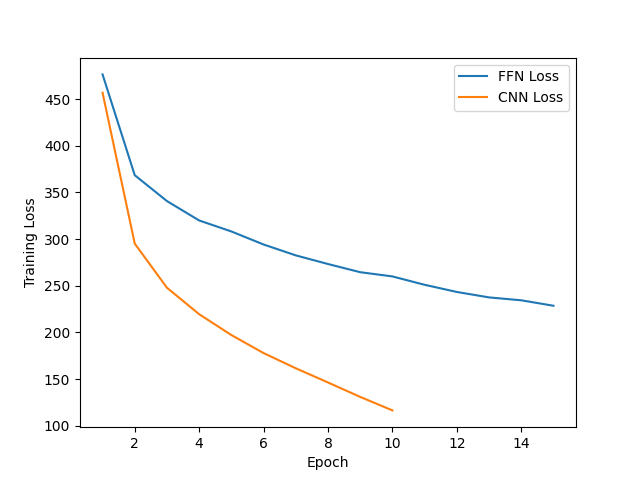
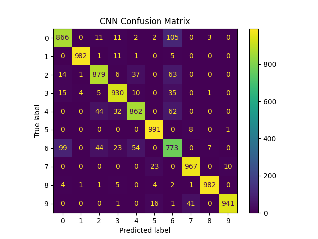
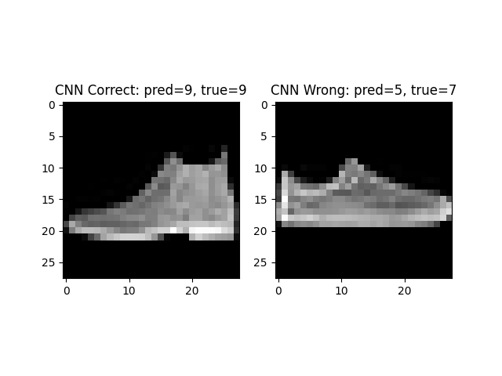

# AI Neural Networks: Fashion-MNIST Classification & Kernel Visualization

A PyTorch-based project that implements two neural networks (a feed-forward network and a convolutional network) to classify Fashion-MNIST images, and then visualizes learned convolutional kernels and feature-map outputs.

---

## Overview

This repository contains a PyTorch implementation of two neural networks trained on the Fashion-MNIST dataset:

1. **Fully-Connected Feedforward Network (FFN)**  
   - Defined in `ffn.py` and integrated via `fashionmnist.py`.  
   - Configurable hidden layers and neuron counts.  
   - Trained on 60,000 images, tested on 10,000 images of 28×28 grayscale fashion items.  
   - Required to reach ≥ 80 % test accuracy.

2. **Convolutional Neural Network (CNN)**  
   - Defined in `cnn.py` and integrated via `fashionmnist.py`.  
   - Configurable number and size of convolutional kernels and pooling layers.  
   - Exploits spatial locality to boost classification accuracy above the FFN.

The end-to-end script `fashionmnist.py` handles downloading via `torchvision`, data splitting, training loops (with adjustable epochs, batch size and learning rate), and generates:

- Training loss curves  
- Correct/incorrect example galleries with human-readable labels  
- Confusion matrices for both models  

Finally, `kernel_vis.py` visualizes what the CNN “sees” by:

- Plotting the learned first-layer convolutional kernels as images  
- Applying each kernel to a provided sample image to extract feature maps  
- Tracing the sample image through each conv + pooling layer to illustrate hierarchical feature extraction  

All models, plots, and visualizations demonstrate how design choices (layer sizes, kernel counts, learning parameters) affect performance on this ten-class image classification task.

---

## Features

- End-to-end PyTorch training loops in `fashionmnist.py`.  
- Custom FFN and CNN architectures defined in `ffn.py` and `cnn.py`.  
- Automatic download of Fashion-MNIST via `torchvision`.  
- Loss-curve plotting and example-image galleries for correct/incorrect predictions.  
- Confusion-matrix generation using `scikit-learn` + `seaborn`.  
- Kernel and feature-map visualization in `kernel_vis.py`.  

---

## Results

**Feed-Forward Network (FFN)**  
- Test accuracy: **88.36 %**  
- Training subset accuracy: **91.15 %**  
- Mean accuracy: **88.83 %**  
- Parameters: **203,530**

**Convolutional Neural Network (CNN)**  
- Test accuracy: **91.47 %**  
- Training subset accuracy: **96.55 %**  
- Mean accuracy: **92.32 %**  
- Parameters: **421,642**

**Training Loss vs. Epoch**  
  
*Figure 1: Training loss over 20 epochs for both the FFN (blue) and the CNN (orange), showing faster convergence and lower final loss for the CNN.*

**CNN Confusion Matrix**  
  
*Figure 2: Confusion matrix on the 10,000 image test set for the CNN, showing per-class precision and recall.*

---

### Example Predictions

**CNN Predictions**  
  
*Figure 3: Examples of test images the CNN got right (to the left) and wrong (to the right).*

---

## File Structure

```bash
.
├── __pycache__/             # Python bytecode
├── data/                    # Downloaded Fashion-MNIST raw files
├── fashionmnist.py          # Entry point for Part I classification
├── ffn.py                   # FFN model definition & utilities
├── cnn.py                   # CNN model definition & utilities
├── kernel_vis.py            # Part II: visualize kernels & feature maps
├── requirements.txt         # pip dependencies
├── ffn_examples.png         # FFN sample predictions
├── cnn_examples.png         # CNN sample predictions
├── loss_curves.png          # Training loss vs. epoch for both models
├── ffn_confusion.png        # FFN confusion matrix
├── cnn_confusion.png        # CNN confusion matrix
├── kernels_grid.png         # Visualized first-layer kernels
├── features_grid.png        # Kernel activations on sample image
├── progression.png          # Feature-map progression through layers
└── README.md                # Project documentation
